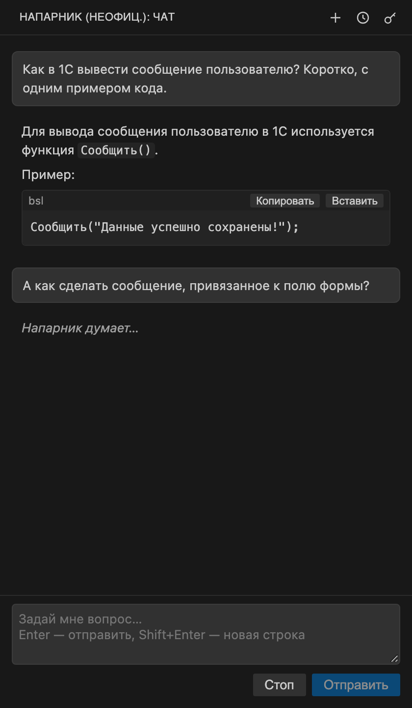

<p align="center">
  
</p>

<h1 align="center">Напарник</h1>

<p align="center">Чат с <a href="https://code.1c.ai">1С:Напарник</a> в VS Code: вопросы по 1С, поиск по ИТС, работа с файлами проекта</p>

<p align="center">
  
</p>

## Возможности

- **Чат** с ответами в реальном времени, историей и несколькими чатами одновременно
- **Поиск по ИТС и документации платформы** — встроенными средствами 1С:Напарника
- **Контекст редактора** — открытый файл или выделенный фрагмент вместе с ошибками VS Code автоматически прикладывается к вопросу
- **@-упоминания файлов и папок** — `@Module.bsl` или `@Catalogs/Клиенты/` в вопросе прикладывает файл или папку проекта, пути подсказываются при вводе
- **Доступ к проекту** — Напарник смотрит структуру, читает и ищет файлы, создаёт, правит, переносит и удаляет их; каждое изменение — только после вашего подтверждения
- **Проверка синтаксиса** — после правки модуля 1С Напарник проверяет изменённые процедуры встроенной проверкой синтаксиса и исправляет ошибки
- **Слэш-команды** — `/init`, `/rules`, `/clear` и другие, как в Claude Code
- **Описание и правила проекта** — `NAPARNIK.md` и папка `.rules/` подставляются в каждый новый чат

## Быстрый старт

1. Установите расширение — найдите «Напарник» во вкладке **Extensions** или выполните:
   ```bash
   code --install-extension winst0niuss.naparnik-1c-chat
   ```
2. Откройте значок Напарника на панели слева и нажмите «Задать токен». API-токен выдаётся в личном кабинете [code.1c.ai](https://code.1c.ai).
3. Задайте вопрос. Enter — отправить, Shift+Enter — новая строка.

Нужен VS Code 1.90 или новее.

## Работа с проектом

Нажмите **«Доступ к проекту»** над полем ввода (или `/project`). Доступ запоминается для каждой папки отдельно; по умолчанию выключен.

- Напарник получает структуру проекта, найденную документацию (README, CLAUDE.md, AGENTS.md, правила Cursor/Copilot и т. п.) и правила из `.rules/`.
- Шаги видны в чате и сворачиваются в одну строку: «Просмотрено: 12 папок, 5 файлов».
- **Изменения файлов** открываются как diff. Решение — в карточке в чате или кнопками ✓/✕ во вкладке diff: **Enter** — применить, **Esc** — отклонить. Без подтверждения файл не меняется.
- **Перенос, копирование и удаление** файлов и папок — тоже через карточку в чате (для папки — со списком файлов). Существующий файл не перезаписывается, удаление — в корзину. После переноса Напарник сообщает, где в проекте упоминается старый путь.
- После правки модуля `.bsl` Напарник проверяет синтаксис изменённых процедур и, если нашёл ошибки, предлагает исправление.
- Пути из `.gitignore` проекта (во всех папках) Напарник не видит в структуре проекта и в поиске.

## Контекст редактора

С каждым вопросом прикладывается файл, открытый в редакторе: выделенный фрагмент с номерами строк или весь файл, а также ошибки и предупреждения VS Code по нему. Что именно уйдёт, показывает чип над полем ввода — клик по нему отключает отправку для этого файла.

Пункт контекстного меню **«Спросить Напарника о выделенном коде»** отправляет вопрос о выделении.

**@-упоминания.** Введите `@` и начало имени или пути — появится список файлов и папок проекта (стрелки, Enter или Tab — вставить). Упомянутые файлы прикладываются к вопросу целиком: до 60 тыс. символов на файл и 150 тыс. на все. Папка прикладывается всеми текстовыми файлами (кроме игнорируемых git); если не помещается — сначала описания (README, `.md`) и файлы верхних уровней; файлы папки берутся только целиком, не поместившиеся перечисляются списком. Работает и без «Доступа к проекту»: файл отправляется, только если вы его упомянули. Если имя подходит к нескольким файлам или папкам, Напарник попросит уточнить путь.

## Слэш-команды

Введите `/` в поле чата — появится список. Команды работают и во время ответа.

| Команда | Что делает |
|---------|-----------|
| `/init` | Изучает проект и создаёт `NAPARNIK.md` — описание, которое подставляется в каждый новый чат |
| `/rules` | Правила проекта из `.rules/`: открыть, создать новое |
| `/make-rules` | Записывает в `.rules/` правила и договорённости из текущего чата |
| `/import [инструменты]` | Переносит в `.rules/` правила Claude Code, Codex (AGENTS.md), Gemini, Cursor, Copilot, Windsurf: `/import cursor claude`, `/import all`. Без аргументов — показывает найденное, ничего не меняя |
| `/clear` | Новый чат |
| `/history` | История чатов |
| `/project` | Включить или выключить доступ к проекту |
| `/stop` | Остановить ответ |
| `/token` | Задать API-токен |
| `/help` | Список команд |
| `/exit` | Остановить ответ и закрыть панель |

Чтобы запомнить правило, достаточно написать «запомни: …» — Напарник добавит его в `.rules/`. `NAPARNIK.md` и `.rules/` — обычные файлы проекта: их можно править вручную и хранить в git, чтобы вся команда работала с одними правилами.

## Настройки

| Настройка | По умолчанию | Описание |
|-----------|--------------|----------|
| `naparnik.skillName` | `custom` | `custom` — с поиском по ИТС и документации, `raw` — только ответ модели |
| `naparnik.timeoutSeconds` | `300` | Сколько секунд ждать данных от сервера, прежде чем прервать ответ |
| `naparnik.baseUrl` | `https://code.1c.ai` | Адрес API |
| `naparnik.authFormat` | `plain` | Формат заголовка Authorization: `plain` или `bearer` |

## Разработка

```bash
npm install
npm test          # unit-тесты, токен не нужен
npm run package   # собрать .vsix (компиляция запускается автоматически)
```

Отладка — F5 в VS Code.

---

## Правовая информация

**Это неофициальный проект.** Он не связан с фирмой «1С», не одобрен и не поддерживается ею. «1С», «1С:Предприятие», «1С:Напарник» — товарные знаки ООО «1С-Софт». Они упоминаются только для того, чтобы указать, с каким сервисом работает расширение.

Для работы нужна собственная учётная запись 1С:Напарник. Расширение не обходит ограничения сервиса, а соблюдение его условий — ответственность пользователя.

**Данные.** Токен хранится в защищённом хранилище VS Code (связка ключей ОС). В сервис 1С:Напарник отправляются ваши вопросы, файл из редактора (если чип контекста включён), а при включённом доступе к проекту — структура проекта и файлы, которые читает Напарник. Что отправлять, решаете вы: доступ к проекту по умолчанию выключен, контекст редактора отключается кликом по чипу, а пути из `.gitignore` Напарник не видит. История чатов хранится локально. Телеметрии нет. Запросы отправляются с заголовком `User-Agent: naparnik-1c-vscode/<версия> (unofficial)`.

**Без гарантий.** Расширение предоставляется «как есть». API сервиса публично не документирован и может измениться. Автор расширения не отвечает за содержание ответов.

Формат API изучен по проектам [1c-ai-mcp](https://github.com/Desko77/1c-ai-mcp) и [spring-mcp-1c-copilot](https://github.com/SteelMorgan/spring-mcp-1c-copilot), подробнее — в [NOTICE](NOTICE). Лицензия — [MIT](LICENSE).
